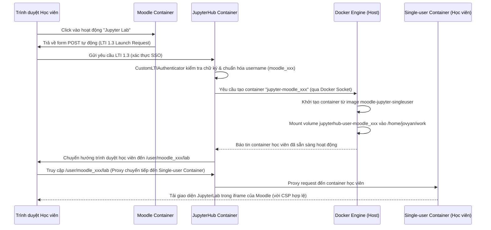

# Nền tảng Moodle + JupyterHub (Tích hợp LTI 1.3 qua Docker Compose)

Dự án này cung cấp môi trường chạy song song và tự động tích hợp Moodle và JupyterHub bằng giao thức LTI 1.3 (xác thực Single Sign-On bảo mật cao) chạy trên Docker Compose.

---

## Kiến trúc Hệ thống (DockerSpawner Model)

Hệ thống được cấu trúc dựa trên các dịch vụ chính được cô lập nhằm tăng hiệu năng, bảo mật và khả năng mở rộng:

1. **`postgres` (PostgreSQL 16)**:
   - Cơ sở dữ liệu duy nhất dùng chung cho toàn bộ dự án.
   - Khi khởi động lần đầu, một SQL script (`postgres/init/01-create-databases.sql`) sẽ tự động chạy để tạo **2 database riêng biệt**:
     - `moodle` (sử dụng bởi user `moodle_user`)
     - `jupyterhub` (sử dụng bởi user `jupyterhub_user`)

2. **`moodle` (Moodle 4.5+ / PHP 8.3 & Apache)**:
   - Đóng vai trò là **LTI 1.3 Platform** (nơi cung cấp khóa học và chứa hoạt động học tập).
   - Sử dụng database `moodle`.
   - Đăng ký và quản lý LTI Tool JupyterHub tự động bằng CLI script `setup_jupyter_lti.php`.

3. **`jupyterhub` (JupyterHub Orchestrator)**:
   - Đóng vai trò là **Hub Server & LTI 1.3 Tool** (nhận diện xác thực người dùng qua LTI 1.3).
   - Sử dụng database `jupyterhub`.
   - **Mount docker socket (`/var/run/docker.sock`)**: Cho phép JupyterHub tương tác trực tiếp với Docker Engine trên host. Khi học viên đăng nhập qua Moodle, Hub sẽ tự động ra lệnh tạo và khởi chạy một container single-user riêng biệt cho học viên đó.

4. **`jupyter-singleuser` (Môi trường của học viên)**:
   - Không khởi động trực tiếp từ docker-compose, mà được build sẵn thành image `moodle-jupyter-singleuser:latest`.
   - Mỗi học viên khi đăng nhập sẽ có một container riêng chạy độc lập từ image này.
   - Chứa toàn bộ môi trường thực hành: Python 3 (pandas, numpy, scipy, matplotlib...) và Java 17 (với nhân **IJava Kernel**).

---

## Cơ chế Hoạt động & Logic Tương tác

Quy trình hoạt động khi học viên click vào liên kết JupyterLab trên Moodle:



1. **Xác thực và Chuẩn hóa**: LTI Authenticator giải mã mã thông báo JWT từ Moodle, lấy thông tin tài khoản và chuẩn hóa thành định dạng username an toàn (ví dụ: `moodle_5f2`).
2. **Cô lập Môi trường (Spawn)**: `DockerSpawner` gọi Docker Engine để tạo container cá nhân có tên `jupyter-moodle-5f2`. Nhờ vậy, tài nguyên (CPU/RAM) của học viên này không ảnh hưởng đến học viên khác hay hệ thống Hub chính.
3. **Bền vững dữ liệu (Persistence)**: Mỗi container được mount với một docker volume riêng (`jupyterhub-user-moodle-5f2`). Dữ liệu bài học của học viên được lưu trữ độc lập tại `/home/jovyan/work` và không bị mất khi container bị tắt hoặc tạo lại.
4. **Nhúng IFrame động (Dynamic CSP)**: Khi container single-user khởi động, nó tự động nạp cấu hình `jupyter_server_config.py` đọc các biến môi trường cấu hình CSP và origin. Điều này cho phép Moodle (`http://localhost:18080`) nhúng giao diện JupyterLab bên trong iframe một cách an toàn mà không bị trình duyệt chặn.

---

## Thư mục Dự án

```text
moodle-jupyter-platform/
├── moodle/                   # Cấu hình container Moodle
│   ├── Dockerfile            # Build image Moodle (PHP 8.3 + Apache)
│   ├── php.ini               # Tối ưu hóa PHP cho Moodle
│   ├── docker-entrypoint.sh  # Chờ DB, cài Moodle tự động, chạy Apache
│   └── config/
│       ├── config.php.template   # Template cấu hình Moodle kết nối DB
│       └── setup_jupyter_lti.php # PHP CLI script cấu hình LTI 1.3
├── jupyterhub/               # Cấu hình container JupyterHub (Orchestrator)
│   ├── Dockerfile            # Build image JupyterHub gọn nhẹ
│   ├── jupyterhub_config.py  # Cấu hình DockerSpawner, LTI Authenticator, Map Volumes
│   └── requirements.txt      # Thư viện cho Hub (dockerspawner, psycopg2-binary...)
├── jupyter-singleuser/       # Cấu hình môi trường cá nhân của học viên
│   ├── Dockerfile            # Build image chứa Python, Java 17, IJava kernel
│   ├── requirements.txt      # Danh sách thư viện Python học tập
│   └── jupyter_server_config.py # Cấu hình cho phép nhúng iframe từ Moodle
├── postgres/
│   └── init/
│       └── 01-create-databases.sql # SQL khởi tạo DB và phân quyền
├── scripts/                  # Các script quản lý hệ thống
│   ├── init.sh               # Kịch bản cài đặt tự động từ đầu
│   ├── start.sh              # Khởi động các dịch vụ
│   ├── stop.sh               # Dừng các dịch vụ
│   ├── restart.sh            # Khởi động lại các dịch vụ
│   ├── reset.sh              # Reset sạch dữ liệu và cấu hình
│   ├── logs.sh               # Xem logs thời gian thực
│   ├── check-docker.sh       # Kiểm tra Docker/Compose
│   ├── wait-postgres.sh      # Đợi DB và database khởi tạo xong
│   ├── wait-moodle.sh        # Đợi Moodle cài đặt hoàn thành
│   ├── configure-lti.sh      # Gọi PHP script xuất config ra lti.env
│   └── doctor.sh             # Chẩn đoán sức khỏe hệ thống (hỗ trợ debug)
├── generated/                # Chứa file cấu hình LTI được sinh ra tự động
│   └── .gitkeep
├── data/                     # Thư mục dữ liệu runtime local
│   ├── moodledata/           # Dữ liệu tệp tin của Moodle (Moodle dataroot)
│   └── backups/              # Thư mục chứa các tệp sao lưu (backups)
├── docs/                     # Tài liệu hướng dẫn chi tiết
│   ├── architecture.md
│   ├── install-local.md
│   └── troubleshooting.md
├── .env.example              # Mẫu file cấu hình các biến môi trường
└── docker-compose.yml        # Quản lý Docker container chính
```
```

---

## Hướng dẫn Khởi chạy Nhanh

1. Đảm bảo bạn đang ở thư mục gốc của dự án trên WSL/Linux.
2. Cấp quyền thực thi cho tất cả các script trong thư mục `scripts`:
   ```bash
   chmod +x scripts/*.sh
   ```
3. Chạy kịch bản khởi tạo tự động toàn bộ hệ thống:
   ```bash
   ./scripts/init.sh
   ```
   *Lưu ý: Script sẽ tự động tạo file `.env` từ `.env.example`, khởi động cơ sở dữ liệu và Moodle, chạy trình cài đặt tự động Moodle, cấu hình LTI tool, ghi thông tin ra `generated/lti.env`, sau đó mới khởi động JupyterHub và kiểm tra hệ thống.*

   *Lưu ý về `generated/lti.env`: Đây là file chứa cấu hình kết nối LTI 1.3 được sinh ra hoàn toàn tự động. Người dùng bình thường chỉ cần chạy `./scripts/init.sh` để bắt đầu. Nếu bạn chạy các lệnh của Docker Compose hoặc lệnh kiểm tra cấu hình (`docker compose config`) trước khi chạy init, hệ thống sẽ tự động khởi tạo file trống nhờ helper `scripts/ensure-generated-env.sh` và tùy chọn `required: false` trong `docker-compose.yml` để không xảy ra lỗi thiếu file.*

---

## Thông tin Truy cập Mặc định

Các port của host đã được đổi để tránh trùng lặp với các dịch vụ mặc định trên máy local của bạn:

- **Moodle Web**: `http://localhost:18080` (Tài khoản Admin: `admin` / Mật khẩu: `admin123`)
- **JupyterHub (LTI Tool)**: `http://localhost:18000` (Không cần truy cập trực tiếp, xác thực qua Moodle)
- **PostgreSQL Database**: Host `localhost`, Port `15432` (Lắng nghe tại địa chỉ Loopback `127.0.0.1` để bảo mật)

---

## Hướng dẫn Kiểm tra Tích hợp LTI 1.3 (Xác thực SSO)

1. Truy cập Moodle `http://localhost:18080` bằng tài khoản admin (`admin` / `admin123`).
2. Vào một Khóa học bất kỳ (hoặc tạo khóa học mới).
3. Bật **Chế độ chỉnh sửa** (Edit mode) ở góc phải màn hình.
4. Chọn **Thêm hoạt động hoặc tài nguyên** (Add an activity or resource) -> chọn **Công cụ ngoài** (External tool).
5. Trong phần thiết lập hoạt động:
   - **Tên hoạt động**: Đặt tên bất kỳ (ví dụ: *Jupyter Lab*)
   - **Công cụ cấu hình sẵn** (Preconfigured tool): Chọn **JupyterHub** từ danh sách thả xuống.
6. Lưu lại hoạt động và bấm vào hoạt động đó. 
7. JupyterHub/JupyterLab sẽ hiển thị trực tiếp trong Moodle thông qua IFrame.
 
> [!IMPORTANT]
> **Lưu ý quan trọng sau khi thay đổi Launch Container sang Embed**:
> 1. Hãy **xóa** toàn bộ các hoạt động "External tool" cũ đã tạo trước đó để tránh lưu cache cấu hình cũ.
> 2. **Tạo lại** hoạt động mới hoàn toàn.
> 3. Trong trường **Công cụ cấu hình sẵn** (Preconfigured tool), chọn chính xác **JupyterHub** từ danh sách thả xuống.
> 4. **Tuyệt đối không tự ý nhập giá trị vào trường Tool URL (URL công cụ) thủ công** để tránh bỏ qua luồng xác thực LTI 1.3.
> 5. Cấu hình mặc định hiện tại sẽ mở hoạt động dưới dạng **Embed** (`launchcontainer = 2`). Điều này đã được tối ưu hóa cookie (`SameSite=None`, `Secure=False`) và tiêu đề CSP để hoạt động mượt mà bên trong IFrame Moodle.

---

## Hướng dẫn Sửa lỗi (Troubleshooting)

### 1. Lỗi Postgres chưa sẵn sàng (Postgres not ready)
- **Triệu chứng**: Moodle báo lỗi không thể kết nối tới DB khi khởi tạo, hoặc script `wait-postgres.sh` lặp vô tận.
- **Khắc phục**: Kiểm tra log database bằng `./scripts/logs.sh postgres`. Đảm bảo không có xung đột port `15432` trên máy host. Nếu cần thiết, chạy `./scripts/reset.sh` và chạy lại `./scripts/init.sh`.

### 2. Lỗi Moodle chưa cài đặt xong (Moodle database not installed)
- **Triệu chứng**: Script `wait-moodle.sh` báo Moodle chưa hoàn thành cài đặt qua CLI.
- **Khắc phục**: Moodle mất từ 1-3 phút để cài đặt toàn bộ bảng cơ sở dữ liệu trên Postgres trong lần chạy đầu tiên. Kiểm tra log Moodle bằng `./scripts/logs.sh moodle` để theo dõi tiến trình cài đặt DB CLI.

### 3. Lỗi file lti.env bị rỗng hoặc thiếu biến
- **Triệu chứng**: Nếu thấy file `generated/lti.env` rỗng hoặc không đủ biến, nghĩa là `configure-lti.sh` chưa được chạy hoặc chạy chưa thành công. Không được chạy JupyterHub LTI khi file `lti.env` còn rỗng.
- **Khắc phục**:
  Chạy lệnh để cấu hình lại LTI và kiểm tra sức khỏe hệ thống:
  ```bash
  sudo ./scripts/configure-lti.sh
  sudo ./scripts/doctor.sh
  ```
  Sau đó khởi động lại JupyterHub bằng lệnh `./scripts/restart.sh` để đảm bảo nạp lại các biến môi trường mới nhất.

### 4. JupyterHub không đọc được cấu hình LTI từ môi trường
- **Triệu chứng**: Log JupyterHub báo lỗi các biến `LTI13_ISSUER` hoặc `LTI13_CLIENT_ID` không tồn tại.
- **Khắc phục**: Đảm bảo file `generated/lti.env` đã được sinh thành công và được mount chính xác vào container jupyterhub. Xem định nghĩa `env_file` trong file `docker-compose.yml` có trỏ đúng đến `./generated/lti.env` không.

### 5. Lỗi IFrame / Cookie
- **Triệu chứng**: Trước đây gặp lỗi màn hình trắng, `Refused to display... in a frame`, hoặc lỗi mất session Cookie (connection reset) khi nhúng JupyterHub trực tiếp dưới dạng IFrame/Embed trong Moodle.
- **Khắc phục**: Hiện tại hệ thống đã được cấu hình mặc định là mở ở chế độ nhúng (**Embed** - `launchcontainer = 2`). Chúng tôi đã cấu hình `cookie_options` cho JupyterHub và single-user server với `SameSite=None` và `Secure=False`, đồng thời đặt header CSP `frame-ancestors` chỉ định chính xác nguồn gốc Moodle (`http://localhost:18080`) để đảm bảo nhúng an toàn và không bị chặn bởi các trình duyệt hiện đại.

---

## Phân quyền nbgrader & Nhận diện vai trò (MVP)

Hệ thống sử dụng cơ chế mount động các volume chứa đề bài và chấm điểm của `nbgrader` dựa trên vai trò của người dùng:

- **Giáo viên (Teacher/Admin)**:
  - Nhận diện (MVP): Kiểm tra tên người dùng (username) có chứa chữ `teacher` hoặc bắt đầu bằng `moodle_teacher_`, hoặc nằm trong danh sách admin (`admin`, `moodle_admin`).
  - Phân quyền: Được mount đầy đủ 3 volume:
    - `nbgrader-exchange` (thư mục trao đổi bài làm tại `/srv/nbgrader/exchange`)
    - `nbgrader-courses` (thư mục quản lý lớp học/bài nộp/điểm tại `/srv/nbgrader/courses`)
    - `nbgrader-templates` (thư mục kho đề gốc tại `/srv/nbgrader/templates`)
- **Học sinh (Student)**:
  - Phân quyền: Chỉ được mount duy nhất volume `nbgrader-exchange` để nhận đề và nộp bài. Hoàn toàn không thể truy cập hay nhìn thấy thư mục `courses` và `templates`.

> [!NOTE]
> **Hướng phát triển tiếp theo (Production TODO)**:
> - Kích hoạt lưu trạng thái xác thực `c.Authenticator.enable_auth_state = True` trong JupyterHub.
> - Đọc trực tiếp các vai trò (roles) LTI 1.3 được Moodle gửi sang trong `auth_state` (như `Instructor`, `TeachingAssistant`, `Administrator`) thay vì nhận diện dựa trên tên đăng nhập.

