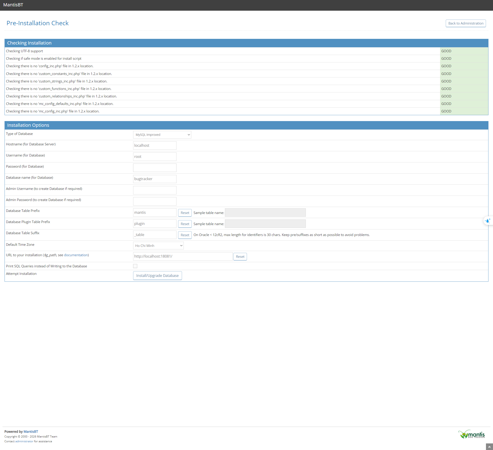
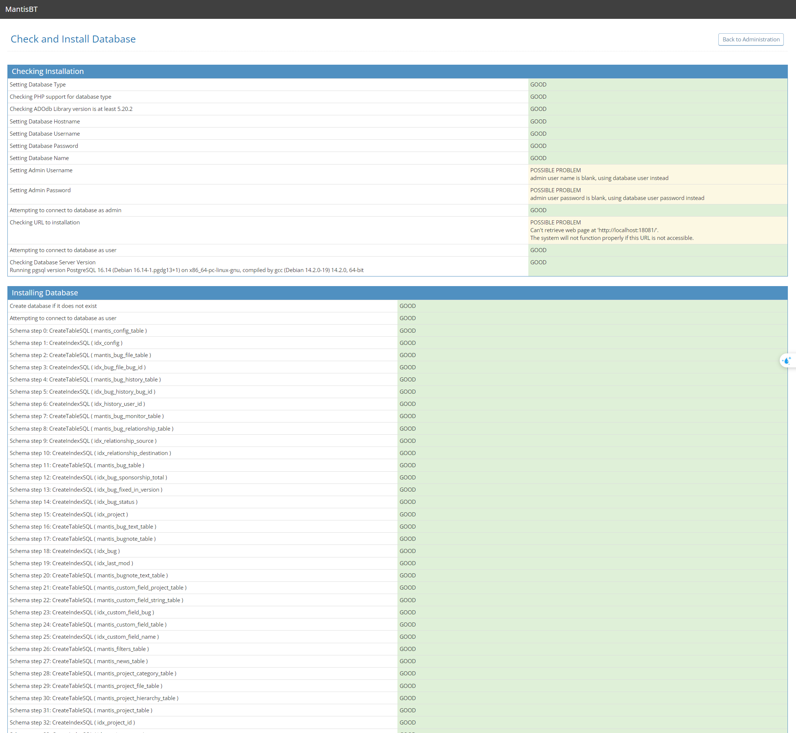
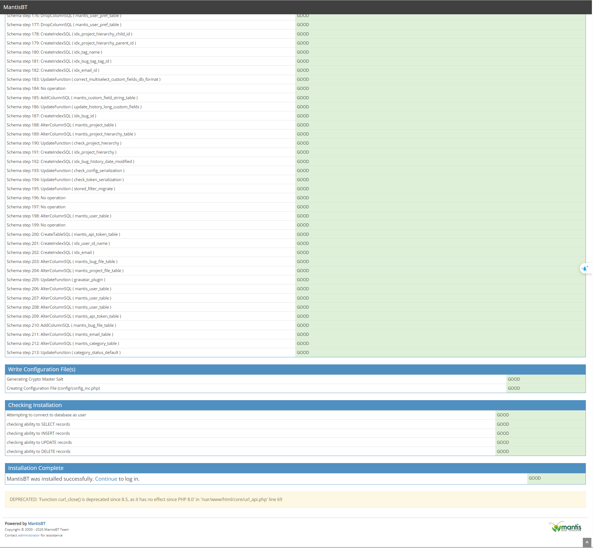
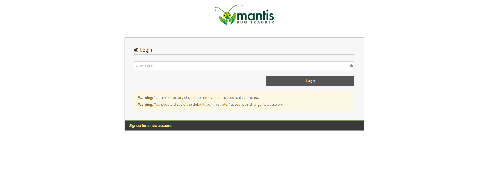
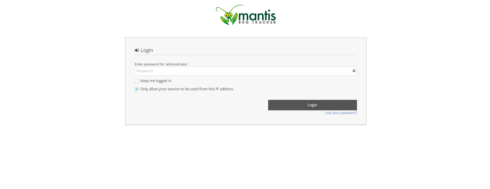
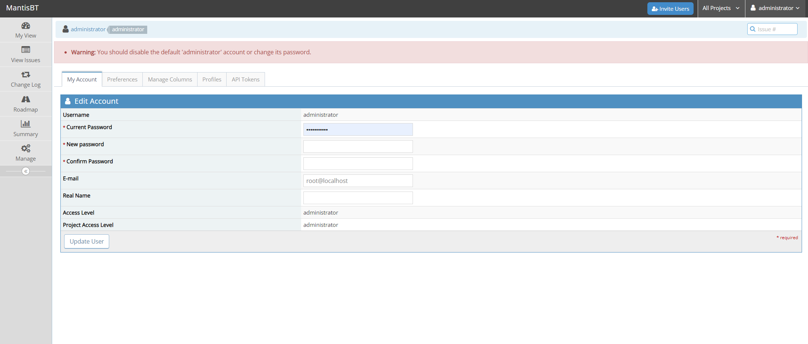
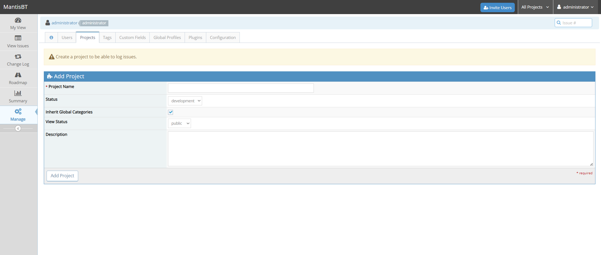
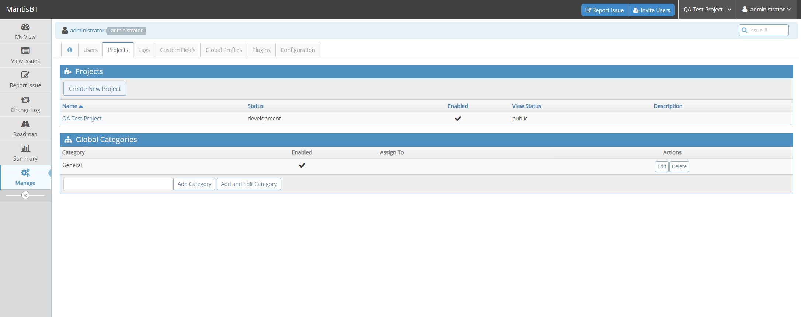

# Hướng dẫn Cài đặt & Khởi tạo Dự án trên Mantis Bug Tracker (MantisBT)

Tài liệu này hướng dẫn chi tiết từng bước thiết lập kết nối cơ sở dữ liệu PostgreSQL, đăng nhập lần đầu và khởi tạo dự án đầu tiên trên hệ thống MantisBT thuộc bộ công cụ QA Tools.

---

## Quy trình Thực hiện chi tiết

### Bước 1: Cấu hình Cơ sở dữ liệu (Pre-Installation Check)
Sau khi chạy thành công lệnh `./init.sh`, bạn truy cập vào đường dẫn [http://localhost:18081](http://localhost:18081). Hệ thống sẽ chuyển hướng tới trang kiểm tra và cấu hình cơ sở dữ liệu ban đầu. 

Bạn điền các thông số kết nối cơ sở dữ liệu PostgreSQL như sau:
*   **Type of Database:** Chọn **`PostgreSQL`** hoặc **`PostgreSQL (PDO)`**.
*   **Hostname (for Database Server):** Điền **`qa-postgres`** (tên dịch vụ DB trong mạng Docker của qa-tools).
*   **Username (for Database):** Điền **`admin`**.
*   **Password (for Database):** Điền **`admin123`**.
*   **Database name (for Database):** Điền **`qa_default_db`**.
*   Các ô **Admin Username / Admin Password** dùng để tạo DB: **Để trống** (do cơ sở dữ liệu đã được Docker khởi tạo sẵn).

Sau đó, click chọn nút **`Install/Upgrade Database`** ở dưới cùng.

---

### Bước 2: Khởi tạo các bảng Database thành công
Hệ thống sẽ chạy tập lệnh SQL để tạo các bảng dữ liệu. Hãy đảm bảo tất cả các hàng đều báo trạng thái **`GOOD`** màu xanh lá cây như các ảnh dưới đây.

Ở dòng dưới cùng, bạn sẽ thấy thông báo **`MantisBT was installed successfully. Continue to log in.`**

Click vào chữ **`Continue`** để chuyển đến trang đăng nhập.

---

### Bước 3: Đăng nhập lần đầu tiên
Tại màn hình đăng nhập:
1.  Nhập tài khoản quản trị mặc định: **`administrator`** -> Click nút **`Login`**.
2.  Tiếp tục điền mật khẩu mặc định: **`root`** -> Click nút **`Login`**.

---

### Bước 4: Đổi mật khẩu tài khoản quản trị
Vì lý do bảo mật, MantisBT yêu cầu bạn đổi mật khẩu tài khoản `administrator` trong lần đăng nhập đầu tiên:
*   **Current Password:** Để mặc định (đã điền sẵn mật khẩu cũ `root`).
*   **New password:** Nhập mật khẩu mới của bạn (ví dụ: `admin123` hoặc mật khẩu tùy chọn khác).
*   **Confirm Password:** Nhập lại mật khẩu mới để xác nhận.

Click nút **`Update User`** ở góc trái để lưu thông tin.

---

### Bước 5: Tạo dự án đầu tiên (Add Project)
Sau khi đổi mật khẩu thành công, bạn sẽ tự động được chuyển đến trang quản lý dự án (**Manage Projects**) để tạo dự án đầu tiên:
*   **Project Name:** Điền tên dự án của bạn (ví dụ: `QA-Test-Project` để đồng bộ với TestLink).
*   **Status:** Chọn trạng thái dự án (mặc định là `development`).
*   **Inherit Global Categories:** Nhấp chọn để kế thừa các danh mục toàn cục.
*   **Description:** Nhập mô tả cho dự án (nếu có).

Click nút **`Add Project`** ở bên dưới.

---

### Bước 6: Khởi tạo dự án thành công
Dự án mới sẽ được tạo thành công và xuất hiện trong bảng danh sách dự án. Tên dự án cũng được hiển thị ở thanh điều hướng trên cùng bên cạnh tài khoản của bạn. 

Bây giờ bạn đã có thể bắt đầu tạo Category, ghi nhận lỗi (Report Issue) và liên kết kịch bản kiểm thử!

