# Hướng dẫn Cài đặt & Sử dụng TestLink 1.9.20 trên Môi trường Docker

Tài liệu này bao gồm hai phần: 
1. **Phần I**: Hướng dẫn cài đặt và cấu hình TestLink ban đầu kết nối với cơ sở dữ liệu PostgreSQL.
2. **Phần II**: Hướng dẫn quy trình tạo và thực thi kịch bản kiểm thử (Test Case Workflow) chi tiết.

---

## MỤC LỤC

### [Phần I: Hướng dẫn Cài đặt & Cấu hình TestLink](#phần-i-hướng-dẫn-cài-đặt--cấu-hình-testlink-1)
*   [Bước A: Khởi chạy trang cài đặt](#bước-a-khởi-chạy-trang-cài-đặt)
*   [Bước B: Đồng ý với Điều khoản sử dụng](#bước-b-đồng-ý-với-điều-khoản-sử-dụng)
*   [Bước C: Kiểm tra tính tương thích hệ thống](#bước-c-kiểm-tra-tính-tương-thích-hệ-thống)
*   [Bước D: Cấu hình kết nối Cơ sở dữ liệu](#bước-d-cấu-hình-kết-nối-cơ-sở-dữ-liệu)
*   [Bước E: Khởi tạo dữ liệu thành công](#bước-e-khởi-tạo-dữ-liệu-thành-công)
*   [Bước F: Đăng nhập vào hệ thống](#bước-f-đăng-nhập-vào-hệ-thống)

### [Phần II: Hướng dẫn Quy trình Tạo & Thực thi Kiểm thử](#phần-ii-hướng-dẫn-quy-trình-tạo--thực-thi-kiểm-thử-1)
*   [Bước 1: Tạo dự án kiểm thử mới (Test Project)](#bước-1-tạo-dự-án-kiểm-thử-mới-test-project)
*   [Bước 2: Xem danh sách dự án](#bước-2-xem-danh-sách-dự-án)
*   [Bước 3: Truy cập trang quản lý kịch bản (Test Specification)](#bước-3-truy-cập-trang-quản-lý-kịch-bản-test-specification)
*   [Bước 4: Chọn dự án trên cây thư mục](#bước-4-chọn-dự-án-trên-cây-thư-mục)
*   [Bước 5: Mở bảng chức năng Test Suite](#bước-5-mở-bảng-chức-năng-test-suite)
*   [Bước 6: Tạo Test Suite mới](#bước-6-tạo-test-suite-mới)
*   [Bước 7: Mở chức năng tạo Test Case](#bước-7-mở-chức-năng-tạo-test-case)
*   [Bước 8: Khởi tạo thông tin Test Case](#bước-8-khởi-tạo-thông-tin-test-case)
*   [Bước 9: Tạo các bước thực hiện (Test Steps)](#bước-9-tạo-các-bước-thực-hiện-test-steps)
*   [Bước 10: Nhập chi tiết các bước và kết quả mong đợi](#bước-10-nhập-chi-tết-các-bước-và-kết-quả-mong-đợi)
*   [Bước 11: Tạo Kế hoạch kiểm thử (Test Plan)](#bước-11-tạo-kế-hoạch-kiểm-thử-test-plan)
*   [Bước 12: Tạo Bản dựng phần mềm (Build / Release)](#bước-12-tạo-bản-dựng-phần-mềm-build--release)
*   [Bước 13: Gán Test Case vào Test Plan](#bước-13-gán-test-case-vào-test-plan)
*   [Bước 14: Xác nhận gán thành công](#bước-14-xác-nhận-gán-thành-công)
*   [Bước 15: Truy cập Giao diện Thực thi (Execute Tests)](#bước-15-truy-cập-giao-diện-thực-thi-execute-tests)
*   [Bước 16: Chọn Test Case cần chạy](#bước-16-chọn-test-case-cần-chạy)
*   [Bước 17: Thực thi và Ghi nhận Kết quả](#bước-17-thực-thi-và-ghi-nhận-kết-quả)

---

## PHẦN I: HƯỚNG DẪN CÀI ĐẶT & CẤU HÌNH TESTLINK

### Bước A: Khởi chạy trang cài đặt
*   Sau khi chạy hệ thống bằng `./init.sh`, bạn truy cập đường dẫn [http://localhost:18082](http://localhost:18082).
*   Nhấp chuột vào dòng chữ **`New installation`** màu đỏ ở giữa màn hình để bắt đầu quá trình cài đặt mới.

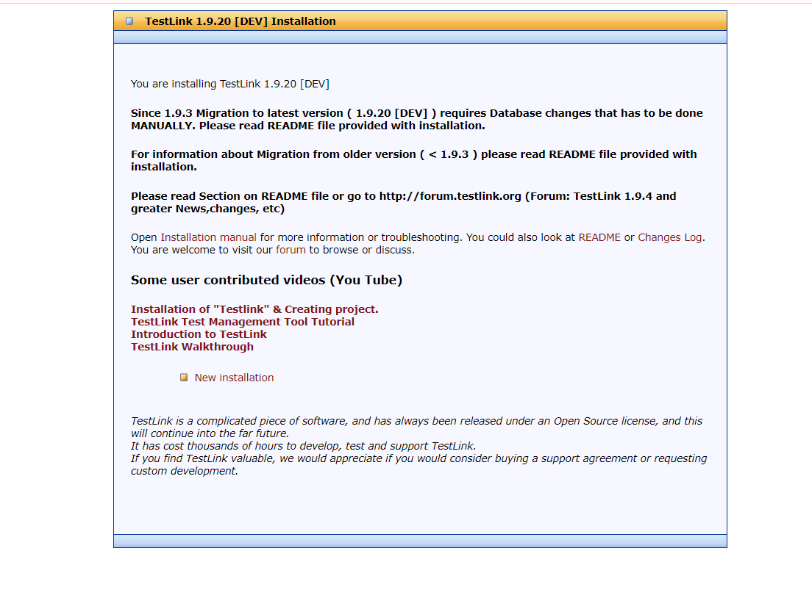

---

### Bước B: Đồng ý với Điều khoản sử dụng
*   Đọc và đồng ý với các điều khoản của giấy phép GPL.
*   Tích chọn vào ô **`I agree to the terms set out in this license.`** ở góc trái dưới cùng.
*   Click chọn nút **`Continue`** ở góc phải dưới cùng.

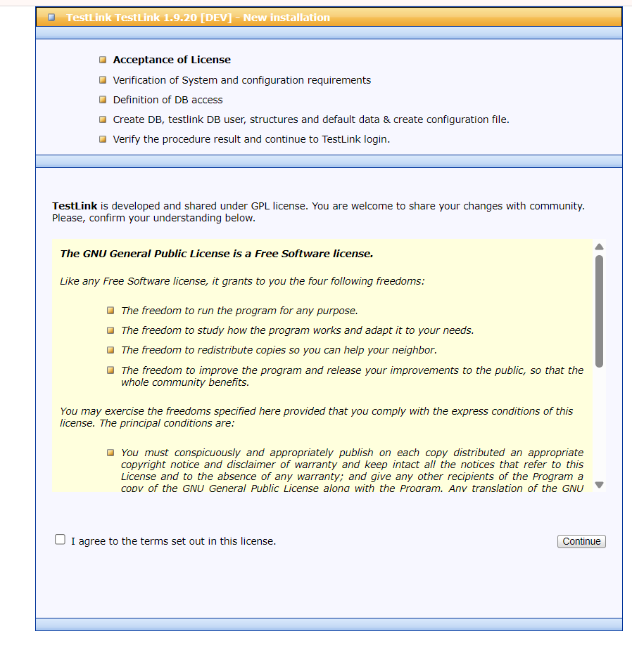

---

### Bước C: Kiểm tra tính tương thích hệ thống
*   Hệ thống sẽ chạy chẩn đoán kiểm tra môi trường PHP và các thư viện hỗ trợ.
*   Đảm bảo không có lỗi nghiêm trọng (hiển thị thông báo màu xanh lá cây: *Your system is prepared for TestLink configuration*).
*   Click chọn nút **`Continue`** ở góc phải dưới cùng.

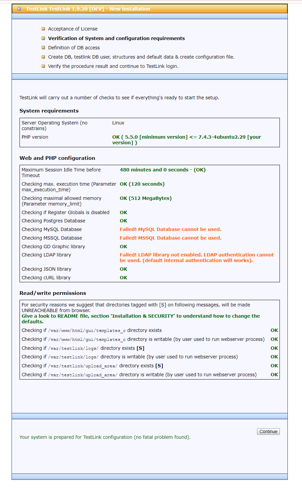

---

### Bước D: Cấu hình kết nối Cơ sở dữ liệu
*   Điền thông số kết nối tới container database PostgreSQL như sau:
    *   **Database Type:** Chọn **`PostgreSQL`**.
    *   **Database host:** Nhập **`qa-postgres`**.
    *   **Database name:** Nhập **`testlink_db`**.
    *   **Table prefix:** **Để trống**.
    *   **Database admin login:** Nhập **`admin`**.
    *   **Database admin password:** Nhập **`admin123`**.
    *   **TestLink DB login:** Nhập **`admin`**.
    *   **TestLink DB password:** Nhập **`admin123`**.
*   Click chọn nút **`Process TestLink Setup!`** ở dưới cùng góc trái để tiến hành cài đặt.

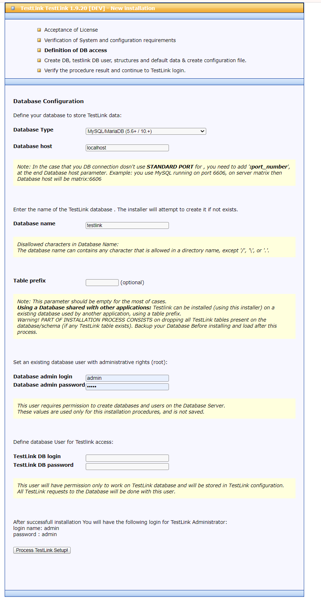

---

### Bước E: Khởi tạo dữ liệu thành công
*   Màn hình sẽ hiển thị quá trình tạo bảng, tạo view và viết tệp tin cấu hình thành công (`OK!`).
*   *(Lưu ý: Hệ thống đã tự động chạy file nạp hàm UDF PostgreSQL `testlink_create_udf0.sql` ở trong `init.sh` nên bạn không cần thực hiện thủ công bước này).*

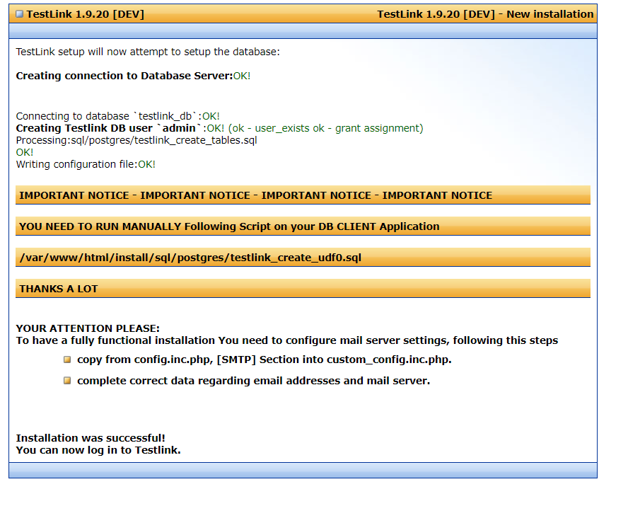

*   Nếu bạn cài đặt lại (re-install), màn hình sẽ thực hiện drop các bảng cũ trước khi tạo mới:

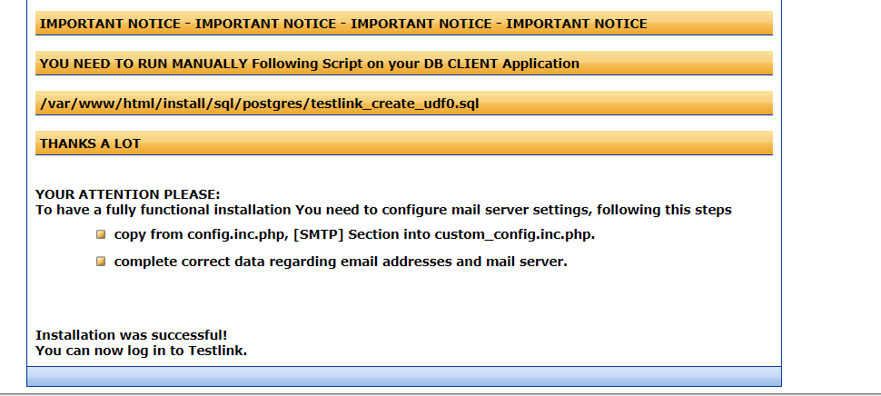

---

### Bước F: Đăng nhập vào hệ thống
*   Click vào liên kết **`You can now log in to Testlink.`** ở dưới cùng màn hình cài đặt thành công.
*   Tại trang đăng nhập, điền tài khoản quản trị mặc định:
    *   **Username:** `admin`
    *   **Password:** `admin`
*   Nhấn **`Log in`** để truy cập vào hệ thống làm việc.

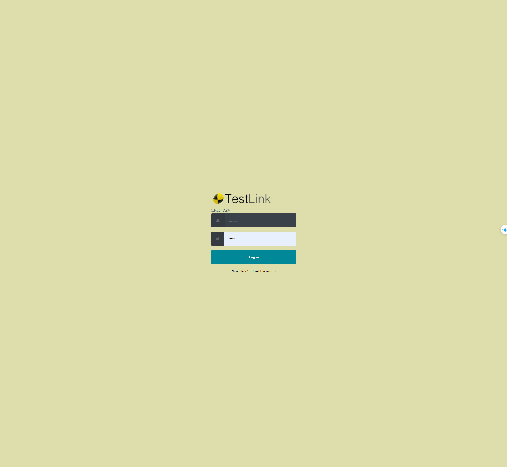

---

## PHẦN II: HƯỚNG DẪN QUY TRÌNH TẠO & THỰC THI KIỂM THỬ

### Bước 1: Tạo dự án kiểm thử mới (Test Project)
*   **Thao tác:** Nhập tên dự án tại ô **Name** và tiền tố quản lý test case tại ô **Prefix** (Ví dụ: `QA-Test-Project` và `MJP-1`).
*   **Trạng thái:** Tích chọn **Active** và **Public**.
*   **Lưu lại:** Click nút **Create** ở dưới cùng góc trái.

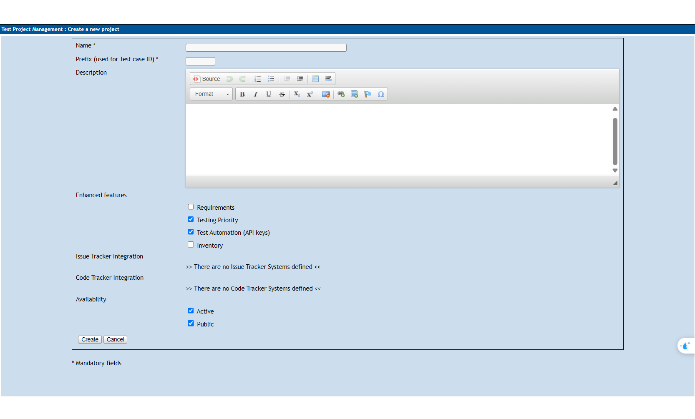

---

### Bước 2: Xem danh sách dự án
*   **Mô tả:** Sau khi lưu, dự án mới tạo sẽ hiển thị trong danh sách quản lý chung của hệ thống với tiền tố tương ứng.

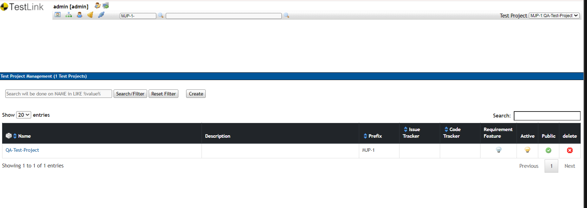

---

### Bước 3: Truy cập trang quản lý kịch bản (Test Specification)
*   **Thao tác:** Trở về Trang chủ (Home) bằng cách nhấp biểu tượng **Ngôi nhà nhỏ** ở góc trên cùng bên trái. 
*   **Tiếp tục:** Click chọn mục **Test Specification** (nằm ở khối chức năng cuối cùng bên trái).

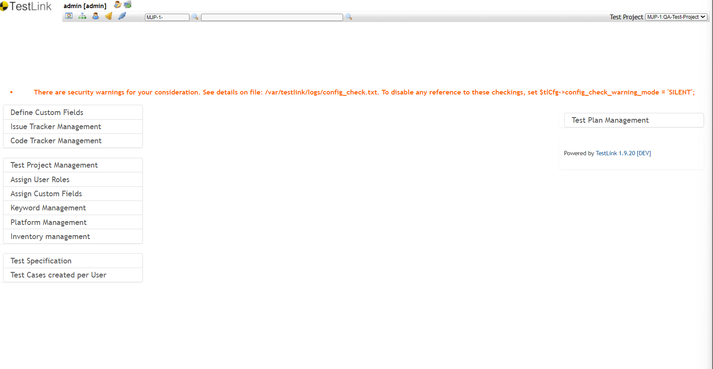

---

### Bước 4: Chọn dự án trên cây thư mục
*   **Thao tác:** Nhìn vào khung Navigator bên trái, nhấp chọn vào thư mục dự án gốc của bạn (Ví dụ: `QA-Test-Project (0)`).

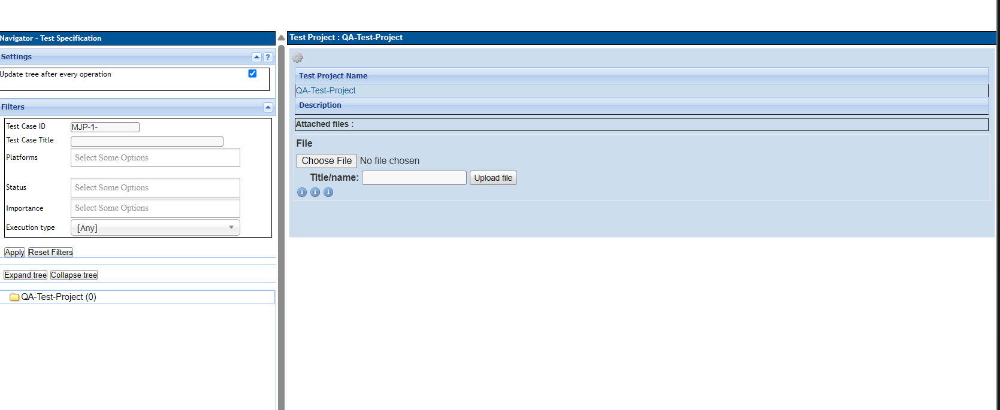

---

### Bước 5: Mở bảng chức năng Test Suite
*   **Thao tác:** 
    1. Nhấp vào biểu tượng **Bánh răng nhỏ (Actions)** ở góc trên bên trái của khung bên phải.
    2. Click vào biểu tượng **Dấu cộng màu xanh lá (`+`)** đầu tiên bên cạnh dòng chữ "Test Suite Operations" để chuẩn bị tạo thư mục chứa Test Case.

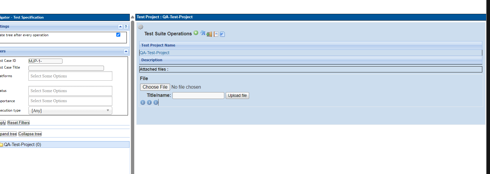

---

### Bước 6: Tạo Test Suite mới
*   **Thao tác:** Nhập tên nhóm kiểm thử vào ô **Test Suite Name** (Ví dụ: `Chức năng Đăng nhập`) rồi nhấn **Save**.

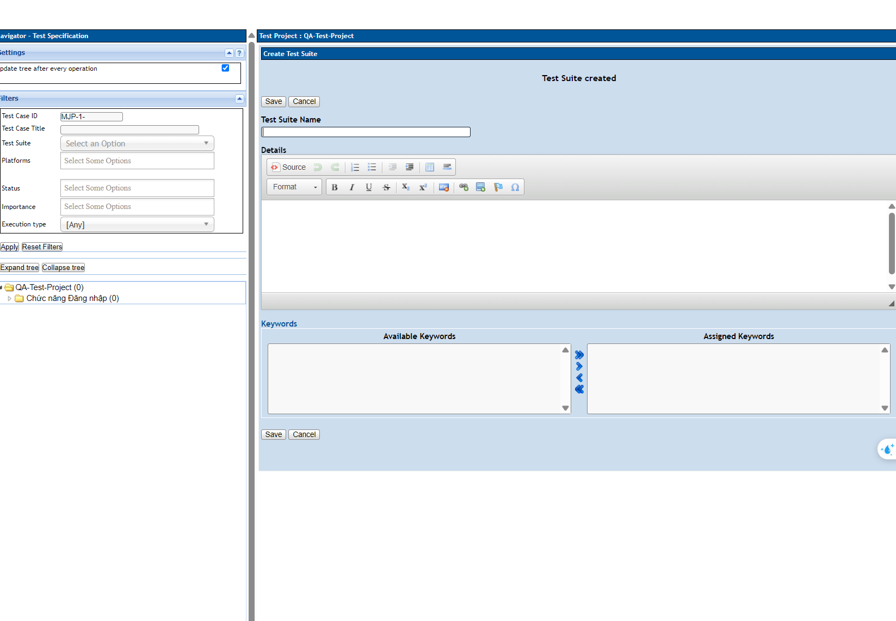

---

### Bước 7: Mở chức năng tạo Test Case
*   **Thao tác:** 
    1. Ở cây thư mục bên trái, chọn thư mục Test Suite vừa tạo (Ví dụ: `Chức năng Đăng nhập (0)`).
    2. Ở khung bên phải, nhấp vào biểu tượng **Bánh răng nhỏ** (Actions).
    3. Nhấn tiếp vào biểu tượng **Dấu cộng màu xanh lá (`+`)** trong phần **Test Case Operations**.

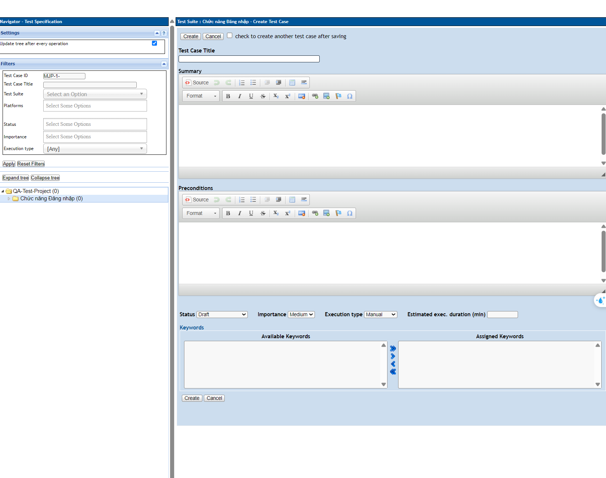

---

### Bước 8: Khởi tạo thông tin Test Case
*   **Thao tác:** 
    *   Điền tiêu đề ca kiểm thử tại ô **Test Case Title** (Ví dụ: `Đăng nhập thành công với tài khoản Admin`).
    *   Nhập tóm tắt kịch bản tại ô **Summary**.
    *   Nhập điều kiện chuẩn bị trước khi test tại ô **Preconditions**.
    *   Click nút **Create** ở trên hoặc dưới biểu mẫu.

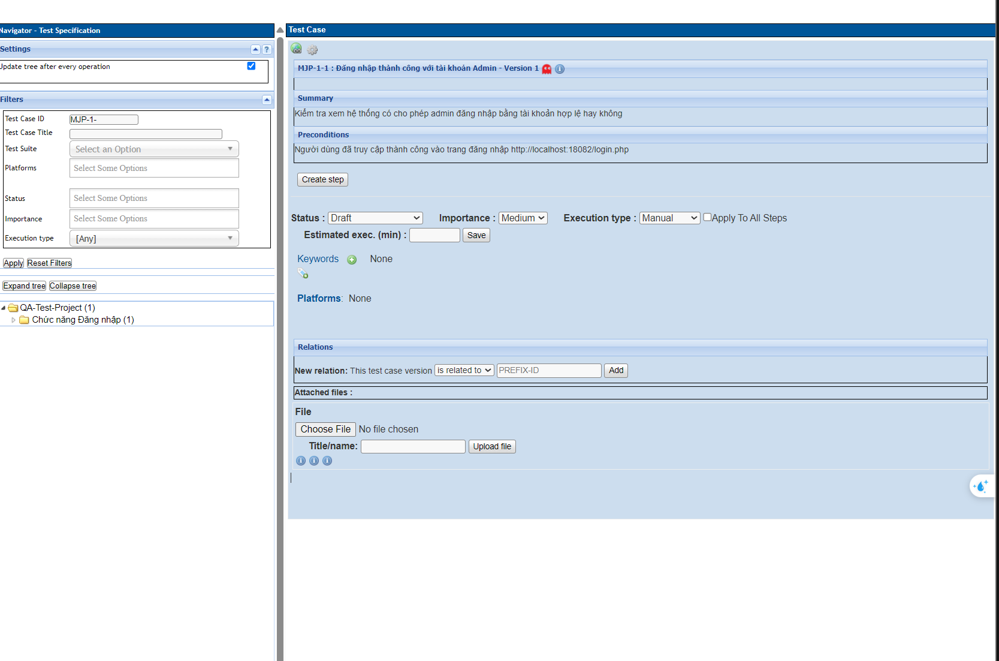

---

### Bước 9: Tạo các bước thực hiện (Test Steps)
*   **Thao tác:** Sau khi Test Case được khởi tạo, nhấn nút **Create step** ở giữa màn hình để bắt đầu viết chi tiết các bước chạy.

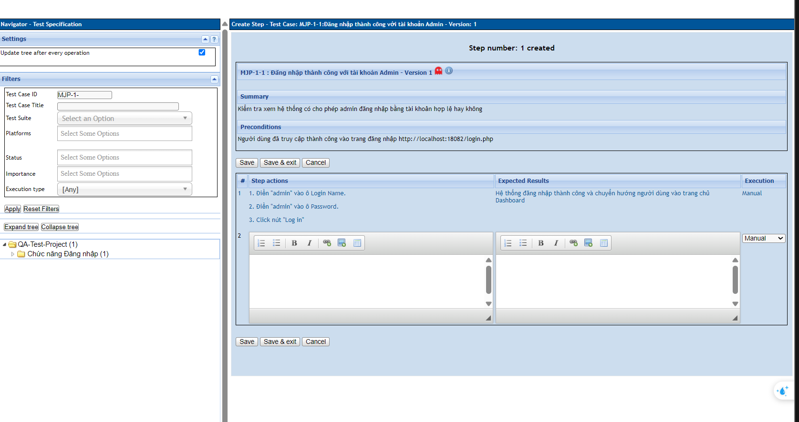

---

### Bước 10: Nhập chi tiết các bước và kết quả mong đợi
*   **Thao tác:** 
    *   **Step actions:** Điền tuần tự hành động của kiểm thử viên (Ví dụ: Nhập user/pass và nhấn Log in).
    *   **Expected Results:** Điền kết quả hệ thống phải trả về (Ví dụ: Đăng nhập thành công và vào dashboard).
    *   **Lưu lại:** Nhấn nút **Save & exit** để hoàn tất kịch bản kiểm thử này.

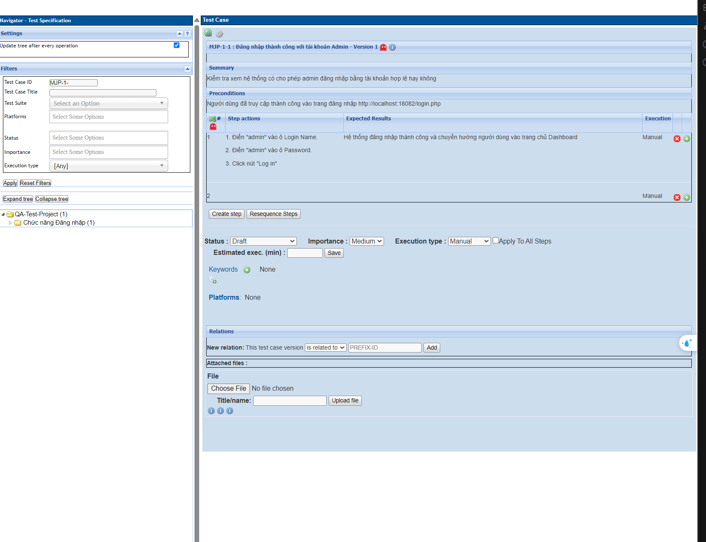

---

### Bước 11: Tạo Kế hoạch kiểm thử (Test Plan)
*   **Thao tác:** Quay về Trang chủ -> Chọn **Test Plan Management** -> Nhấn **Create** để lập một kế hoạch kiểm thử mới (Ví dụ: `Kế hoạch Test Login v1.0`).

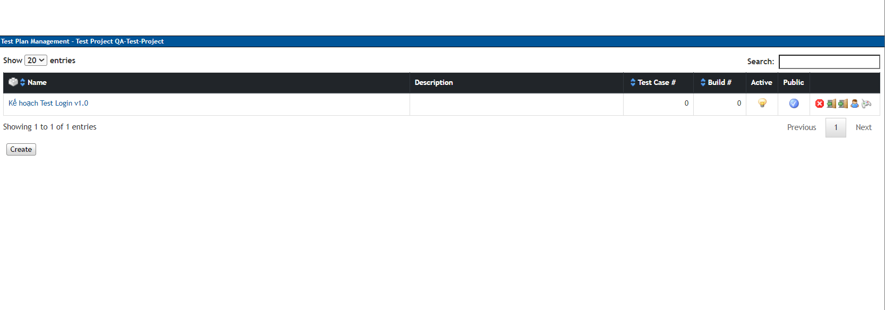

---

### Bước 12: Tạo Bản dựng phần mềm (Build / Release)
*   **Thao tác:** Quay về Trang chủ -> Chọn **Builds / Releases** -> Nhấn **Create** để định nghĩa phiên bản sản phẩm cần test (Ví dụ: `Build_v1.0`).

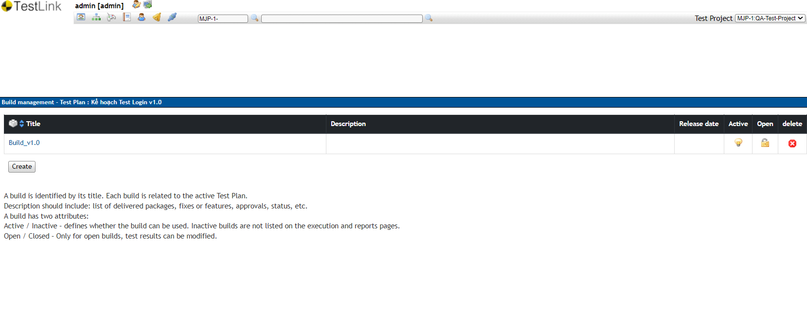

---

### Bước 13: Gán Test Case vào Test Plan
*   **Thao tác:** 
    1. Quay về Trang chủ -> Chọn mục **Add / Remove Test Cases** ở cột bên trái.
    2. Chọn Test Suite từ cây thư mục bên trái.
    3. Tích chọn ô vuông trước Test Case cần gán ở khung bên phải.
    4. Nhấp nút **Add selected** ở hàng công cụ phía trên.

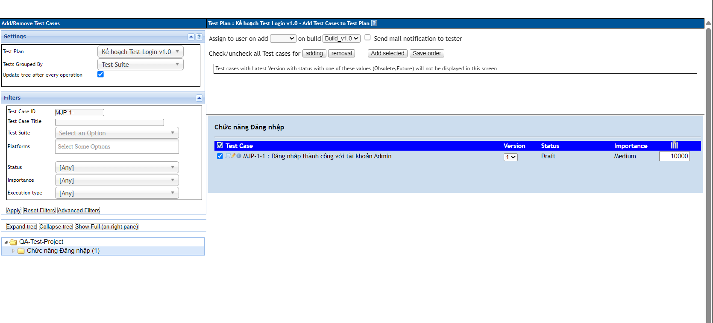

---

### Bước 14: Xác nhận gán thành công (Màu nền vàng)
*   **Mô tả:** Khi gán thành công, nền của dòng Test Case sẽ tự động đổi sang màu vàng nhạt.

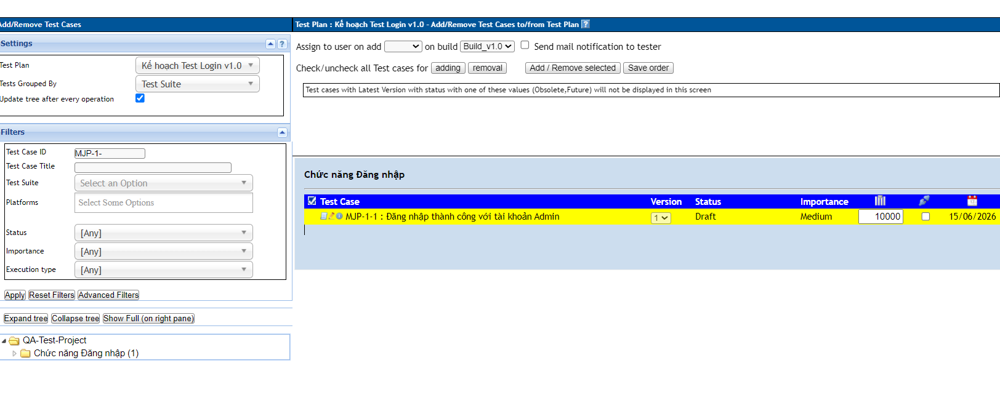

---

### Bước 15: Truy cập Giao diện Thực thi (Execute Tests)
*   **Thao tác:** Quay về Trang chủ -> Click chọn mục **Execute Tests** ở cột bên phải dưới cùng của danh sách kế hoạch kiểm thử.

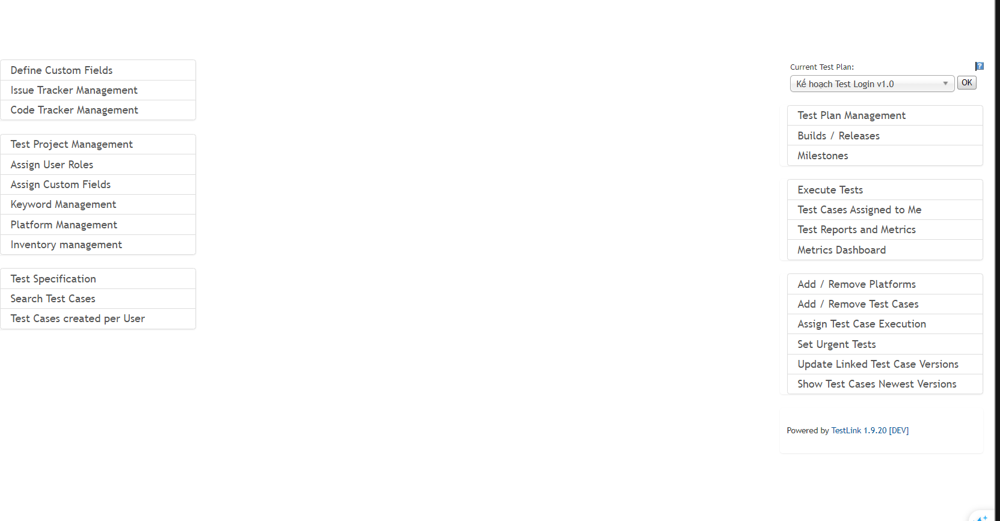

---

### Bước 16: Chọn Test Case cần chạy
*   **Thao tác:** Chọn Test Suite và nhấp trực tiếp vào tên Test Case cần chạy ở cây thư mục góc bên trái màn hình.

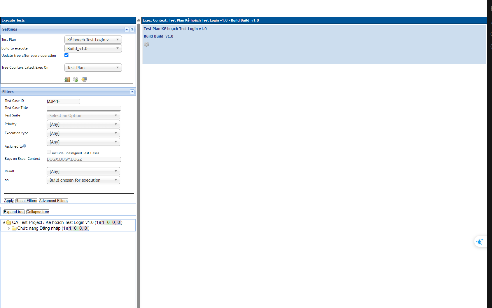

---

### Bước 17: Thực thi và Ghi nhận Kết quả
*   **Thao tác:** 
    1. Tiến hành kiểm thử trên phần mềm thực tế theo các bước hướng dẫn.
    2. Tại bảng **Step actions**, chọn trạng thái kiểm thử của bước đó là **Passed** (hoặc Failed).
    3. Điền ghi chú chạy thực tế vào ô **Notes / Description** ở dưới cùng.
    4. Nhấp chọn biểu tượng **Mặt cười màu xanh lá** (ở khung bên phải ô ghi chú) để lưu lại kết quả **Passed (Đạt)** cho toàn bộ ca kiểm thử này.

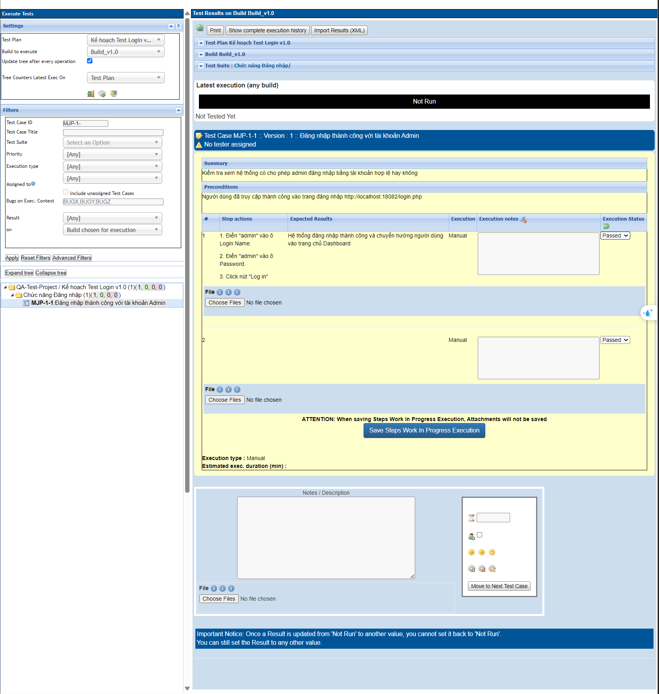

---

> [!TIP]
> Bạn có thể lặp lại quy trình trên để tạo thêm các nhóm kiểm thử và ca kiểm thử nâng cao cho các chức năng khác của hệ thống!
